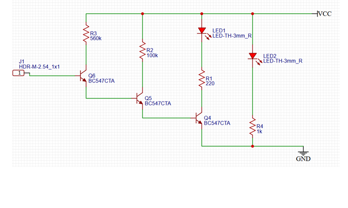

# Non-Contact AC Voltage Detector (Live Wire Sensor)

A simple, low-cost **non-contact AC voltage detector** built using a 3-stage NPN transistor amplifier cascade (BC547) that senses stray capacitive coupling from a 230V AC live conductor and lights an LED to indicate its presence — without any direct electrical contact with mains.



---

## 1. Aim

To design and simulate a non-contact AC live-wire detector circuit that:
- Detects the presence of 230V AC mains voltage near an insulated or bare live conductor.
- Uses capacitive coupling (no galvanic/direct connection to mains) for user safety.
- Provides visual indication via an LED when a live wire is detected.
- Includes a separate power-on indicator LED.

---

## 2. Working Principle

The probe wire (connected at **J1**) is brought close to (not touching) a live AC conductor. Because the probe and the live wire are not directly connected, they form a small **coupling capacitor** (typically ~0.5–2 pF) through the air/insulation gap. This capacitor injects a tiny AC current (in the nanoampere range) into the base of the first transistor stage.

A single BC547 transistor does not have enough current gain (hFE) to convert a few nanoamps into a current large enough to visibly light an LED. To solve this, **three NPN transistors (Q6 → Q5 → Q4) are cascaded**, multiplying the current gain of each stage:

```
hFE(total) ≈ hFE(Q6) × hFE(Q5) × hFE(Q4)
```

With hFE ≈ 200–400 per transistor (BC547C grade), the total gain reaches **10⁶–10⁷**, which is more than enough to amplify a ~100 nA input signal into a several-milliamp output capable of driving LED1.

Since the coupled signal is AC (50 Hz), the final stage (Q4) switches LED1 on and off at mains frequency. Due to persistence of vision, this appears to the eye as a flicker or steady glow whenever the probe is near a live conductor — and it stays off near a neutral or earth wire (no AC field to couple).

LED2, along with R4, is wired directly across the supply and is always on whenever the circuit is powered — it acts purely as a **power indicator**, independent of detection.

---

## 3. Circuit Description / Block Diagram

```
J1 (Probe) → Q6 (sense/1st amp) → Q5 (2nd amp) → Q4 (switch) → LED1 (detection indicator)
                                                              
VCC ────────────────────────────────────────────────────────→ LED2 + R4 (power indicator)
```

| Stage | Component | Function |
|---|---|---|
| Sensing input | J1, R3 | Couples AC signal from probe into Q6 base |
| 1st amplification | Q6, R2 | Amplifies µA-level base current |
| 2nd amplification | Q5 | Further amplifies signal to drive Q4 |
| Output switch | Q4, R1 | Switches LED1 on/off at mains frequency |
| Detection indicator | LED1 | Flickers/glows near live AC |
| Power indicator | LED2, R4 | Always-on when circuit is powered |

---

## 4. Components Used (EDA / BOM)

| Reference | Component | Value / Part | Package | Role |
|---|---|---|---|---|
| J1 | Header connector | HDR-M-2.54_1x1 | 2.54mm pin header | Probe wire connection point |
| Q6, Q5, Q4 | NPN Transistor | BC547C | TO-92 | 3-stage Darlington-like amplifier cascade |
| R3 | Resistor | 560 kΩ | THT | Sensing / Q6 base bias resistor |
| R2 | Resistor | 100 kΩ | THT | Q6 collector load / Q5 base drive |
| R1 | Resistor | 220 Ω | THT | LED1 current-limiting resistor |
| R4 | Resistor | 1 kΩ | THT | LED2 current-limiting resistor |
| LED1 | LED | LED-TH-3mm Red | 3mm THT | AC detection indicator |
| LED2 | LED | LED-TH-3mm Red | 3mm THT | Power-on indicator |
| VCC | Supply | 5V DC | — | Circuit power supply |
| GND | Ground | — | — | Common return |

**EDA Tool:** Designed and simulated using a Easy EDA schematic capture tool 

---

## 5. Design Calculations

**Assumed supply voltage: VCC = 5V**
**Target: detect proximity to 230V, 50Hz AC mains via capacitive coupling**

### 5.1 Capacitive coupling current (input signal)

The probe and live conductor form a stray coupling capacitance (C_c), typically 0.5–2 pF for a short wire held near insulated wiring. The current induced into the base circuit:

```
I(coupled) = V × 2πf × C_c
```

For V = 230V, f = 50Hz, C_c = 1 pF:

```
I(coupled) = 230 × 2π × 50 × (1×10⁻¹²) ≈ 72 nA
```

Typical real-world range: **10 nA – 200 nA**, depending on proximity and wire length.

### 5.2 Q6 base bias — R3 (560 kΩ)

```
Ib(Q6, idle) = (VCC − Vbe) / R3 = (5 − 0.7) / 560,000 ≈ 7.7 µA
```

R3 is kept high-value deliberately: a higher resistance produces a larger voltage swing (V = I × R) at Q6's base for the same tiny coupled current, maximizing sensitivity. This is the resistor to tune if the detector is too sensitive/insensitive.

### 5.3 Q5 base drive — R2 (100 kΩ)

R2 acts as Q6's collector pull-up and Q5's base resistor:

```
Ib(Q5, max) = (VCC − 0.7) / R2 = (5 − 0.7) / 100,000 ≈ 43 µA
```

When Q6 conducts, it pulls this node low (~0.2V), starving Q5's base and turning Q5 off — this is what creates the switching (flicker) action synced to the 50Hz AC cycle.

### 5.4 Overall gain requirement

To drive Q4 into saturation (~1 mA base-referred switching current) from an input of ~100 nA:

```
Required gain ≈ 1 mA / 100 nA = 10,000×
```

Three cascaded BC547 stages (hFE ≈ 200–400 each) provide:

```
hFE(total) ≈ 200³ to 400³ = 8×10⁶ to 6.4×10⁷
```

This is far more than the ~10,000× required, giving comfortable margin for hFE variation between transistor batches.

### 5.5 LED1 current — R1 (220 Ω, detection indicator)

Path: VCC → LED1 → R1 → Q4 (Collector-Emitter, saturated) → GND

```
I(LED1) = (VCC − Vf(LED) − Vce(sat)) / R1
        = (5 − 2 − 0.2) / 220
        ≈ 12.7 mA
```

This is a safe, bright drive current (BC547 max Ic = 100 mA, so well within limits).

### 5.6 LED2 current — R4 (1 kΩ, power indicator)

Path: VCC → LED2 → R4 → GND (always on, not gated by any transistor)

```
I(LED2) = (VCC − Vf(LED)) / R4 = (5 − 2) / 1000 = 3 mA
```

Deliberately dimmer than LED1 since it only indicates "circuit powered," not detection.

### 5.7 Design summary table

| Parameter | Formula | Value @ VCC = 5V |
|---|---|---|
| Coupled input current | I = V × 2πf × C_c | ~10–200 nA |
| Q6 idle base current | (VCC−0.7)/R3 | ~7.7 µA |
| Q5 max base current | (VCC−0.7)/R2 | ~43 µA |
| Required total gain | I(out)/I(in) | ~10,000× |
| Available gain (3×BC547) | hFE³ | ~10⁶–10⁷ |
| LED1 current | (VCC−Vf−Vce_sat)/R1 | ~12.7 mA |
| LED2 current | (VCC−Vf)/R4 | ~3 mA |

---

## 6. Safety Note

The probe (J1) is **not directly wired to mains** — it must only be brought near an insulated live conductor, never connected to bare 230V AC. R3 (560kΩ) is sized for nanoampere-level *capacitively coupled* signals only; if J1 were ever hard-connected to 230V AC, it would pass a continuous ~0.4 mA into Q6's base, exceeding the BC547's base-emitter ratings and destroying the transistor. This circuit is designed strictly as a **proximity / non-contact detector**.

---

## 7. Applications / Use Cases

- Identifying live wires before electrical work (basic voltage tester / "test pen" functionality).
- Detecting broken/live wires behind walls or in conduits without contact.
- Teaching aid for demonstrating capacitive coupling and transistor cascade amplification.
- Low-cost DIY alternative to commercial non-contact voltage testers.

---

## 8. Limitations

- Cannot indicate exact voltage magnitude — detection only (on/off).
- Sensitivity depends heavily on probe wire length, proximity, and insulation thickness.
- Batch-to-batch hFE variation in BC547 transistors can affect consistency between units.
- Not a substitute for a certified/calibrated voltage tester in safety-critical work.

---

## 9. Future Improvements

- Add a buzzer for audible alert alongside LED1.
- Add hysteresis/debounce to stabilize flicker into a steady glow.
- Enclose in an insulated pen-style housing with a rated probe tip.
- Add sensitivity adjustment via a potentiometer in place of R3.

